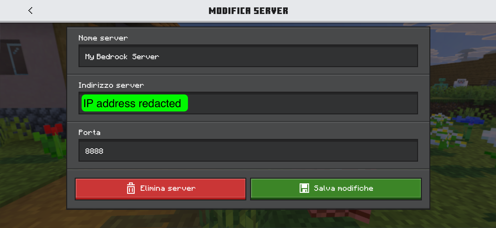
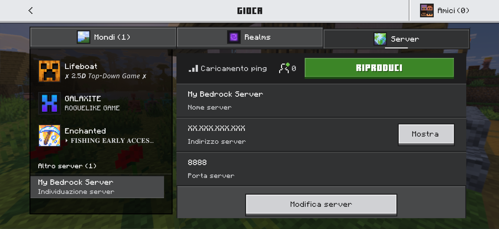
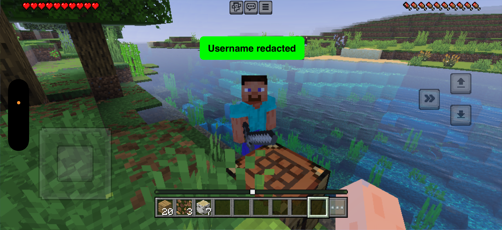
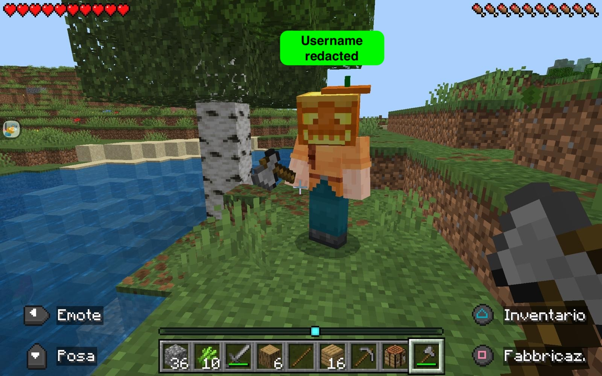
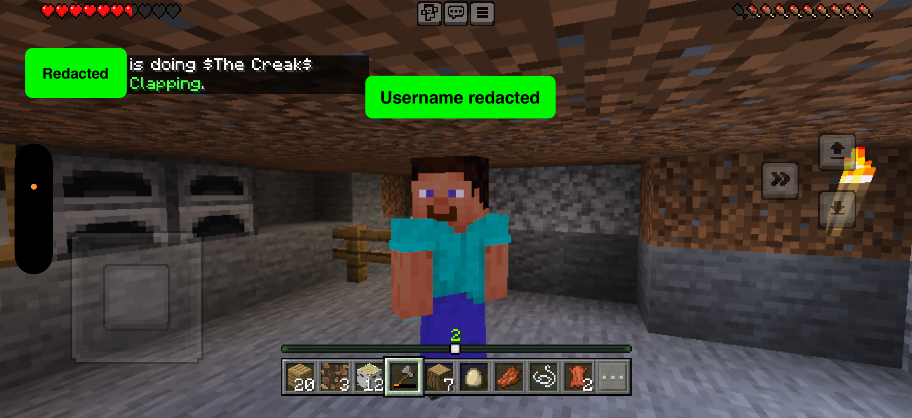

# Minecraft Bedrock Server with Docker
This repository contains the code, configuration files, and all the steps needed to start and manage a **Minecraft Bedrock Server** using **Docker** and **Docker compose**.

This setup was tested on a remote machine running **Ubuntu 22.04.5 LTS (GNU/Linux 5.15.0-134-generic x86_64)**.  
Client testing was performed using **iOS** and **Android** devices.

This repository was created during my training at the *Developer Academy*.

## Table of Contents

- [Important Caveats](#important-caveats)
- [Quickstart using Docker](#quickstart-using-docker)
    - [Prerequisites](#prerequisites)
    - [Connect to the Remote Machine](#connect-to-the-remote-machine)
    - [Clone the repository](#clone-the-repository)
    - [Create and setup the .env file](#create-and-setup-the-env-file)
    - [Start the server with Docker Compose](#start-the-server-with-docker-compose)
- [Usage](#usage)
    - [.env file](#env-file)
    - [Logs](#logs)
    - [Adding players](#adding-players)
    - [World Data Backup and Restore](#world-data-backup-and-restore)
    - [Update and maintenance Docker Cheat Sheet](#update-and-maintenance-docker-cheat-sheet)
    - [Local testing](#local-testing)
    - [Data persistency](#data-persistency)
- [Screenshots](#screenshots)

### Important Caveats
- **Server version must match the client version**. Always verify both (and adjust accordingly) before starting the server to avoid compatibility issues.
- This projects revolves around **Minecraft Bedrock Edition**, accessible from Bedrock clients on Windows 10/11, Xbox, PlayStation, Switch, Mobile.
    - Java Editions clients will not work with this server

## Quickstart
This guide is designed for hosting the server on a **remote machine**. For local hosting, check the [Usage](#usage) section.

### Prerequisites
- [Docker](https://docs.docker.com/engine/install/) (installed and running)
- [Docker Compose](https://docs.docker.com/compose/install/) 
- A terminal or shell environment of your choice
- SSH access to a remote machine
---
### Connect to the Remote Machine
```bash
ssh <user>@<remote_ip>
```
--- 

### Clone the repository
```bash
git clone https://github.com/domenicoindrio/minecraft_bedrock_server_docker.git
cd minecraft_bedrock_server_docker/
```
---

### Create and setup the `.env` file
The provided template is ready to use, just ensure that the `BEDROCK_VERSION` matches your client version:

```bash
cp server_config_template.env .env
```
---

### Start the server with Docker Compose
```bash
docker compose up -d mc-server
```
If everything worked correctly, the server should be running.  
Players can join by adding the **server name** and **IP address** in Minecraft's "Server" section.
The port used for this project is the `8888`.






> [!NOTE]  
Avoid running `docker compose up -d` without specifying the service. Doing so would start not only `mc-server`, but also `mc-backup` and `mc-restore`, which are meant to be run manually or on-demand.
---

## Usage
This section covers some useful tips for interacting with this project:

### .env file
The provided template is ready to use. Advanced variables are commented out. If uncommented they'll be automatically picked up and generated through the `entrypoint.sh` script.

For a detailed explanation of each variable, check the [server variable descriprion document](./docs/server_var_description.md) located in `/docs`.

---

### Logs  
To verify the startup process or debug issues, check the container logs:
```bash
docker compose logs -f mc-server
# `-f`stream logs continuously in real time
``` 
Example of the output of a successful server start:
```bash
minecraft-bedrock  | [*] Generating server.properties from environment...
minecraft-bedrock  | [+] server.properties generated at /bedrock/server.properties
minecraft-bedrock  | [+] Running bedrock_server...
minecraft-bedrock  | NO LOG FILE! - setting up server logging...
minecraft-bedrock  | [2025-10-26 19:14:40:837 INFO] Starting Server
minecraft-bedrock  | [2025-10-26 19:14:40:837 INFO] Version: 1.21.114.1
minecraft-bedrock  | [2025-10-26 19:14:40:837 INFO] Session ID: 0f609e46-2e47-4801-8cdf-d7604a05a828
minecraft-bedrock  | [2025-10-26 19:14:40:837 INFO] Build ID: 37977209
minecraft-bedrock  | [2025-10-26 19:14:40:837 INFO] Branch: r/21_u11
minecraft-bedrock  | [2025-10-26 19:14:40:837 INFO] Commit ID: 5b20d43687fa1b240b3aabe2ec29f1389a5fd627
minecraft-bedrock  | [2025-10-26 19:14:40:837 INFO] Configuration: Publish
minecraft-bedrock  | [2025-10-26 19:14:40:838 INFO] Level Name: Za Warudo
minecraft-bedrock  | [2025-10-26 19:14:40:839 INFO] No CDN config file found at: cdn_config.json for dedicated server
minecraft-bedrock  | [2025-10-26 19:14:40:840 INFO] Game mode: 0 Survival
minecraft-bedrock  | [2025-10-26 19:14:40:840 INFO] Difficulty: 1 EASY
minecraft-bedrock  | [2025-10-26 19:14:40:842 INFO] Content logging to console is enabled.
minecraft-bedrock  | [2025-10-26 19:14:41:733 INFO] Opening level 'worlds/Za Warudo/db'
minecraft-bedrock  | [2025-10-26 19:14:41:758 INFO] [SERVER] Pack Stack - None
minecraft-bedrock  | [2025-10-26 19:14:43:288 INFO] IPv4 supported, port: 19132: Used for gameplay and LAN discovery
minecraft-bedrock  | [2025-10-26 19:14:43:288 INFO] IPv6 supported, port: 19133: Used for gameplay
minecraft-bedrock  | [2025-10-26 19:14:43:361 INFO] Server started.
minecraft-bedrock  | [2025-10-26 19:14:43:362 INFO] ================ TELEMETRY MESSAGE ===================
minecraft-bedrock  | [2025-10-26 19:14:43:362 INFO] Server Telemetry is currently not enabled. 
minecraft-bedrock  | [2025-10-26 19:14:43:362 INFO] Enabling this telemetry helps us improve the game.
minecraft-bedrock  | [2025-10-26 19:14:43:362 INFO] 
minecraft-bedrock  | [2025-10-26 19:14:43:363 INFO] To enable this feature, add the line 'emit-server-telemetry=true'
minecraft-bedrock  | [2025-10-26 19:14:43:363 INFO] to the server.properties file in the handheld/src-server directory
minecraft-bedrock  | [2025-10-26 19:14:43:363 INFO] ======================================================
```
---

### Adding players  
Since the `allowlist` is set to `true` (recommended to control who can join), players must be added to the `allowlist.json`

This can be done directly through the minecraft server console:
```bash
docker attach minecraft-bedrock
```
Then, inside the console:
```bash
allowlist add Gamertag
```
At the end, detach from the container by pressing **Ctrl-P**, **Ctrl-Q**.

If those keys are reserved, set a different combination <u>**before**</u> attaching, eg.:   
```bash
docker attach --detach-keys="ctrl-x,ctrl-x" minecraft-bedrock
```

Log example:
```bash
minecraft-bedrock  | allowlist add Player1
minecraft-bedrock  | [2025-10-27 11:07:04:927 INFO] Player added to allowlist
minecraft-bedrock  | [2025-10-27 11:07:32:993 INFO] Player connected: Player1, xuid: 0123456789000000
minecraft-bedrock  | [2025-10-27 11:07:43:440 INFO] Player Spawned: Player1 xuid: 0123456789000000, pfid: 
minecraft-bedrock  | [2025-10-27 11:08:33:804 INFO] Player connected: Player2, xuid: 0123456789000001
minecraft-bedrock  | [2025-10-27 11:08:39:149 INFO] Player Spawned: Player2 xuid: 0123456789000001, pfid: 
```

> [!IMPORTANT]  
If the player, still can't join, attach again to the container and run `allowlist reload` to force reloading the whitelist.

> [!NOTE]  
Open `bedrock_server_how_to.html` (located in [`/docs`](./docs/)) in a browser, for a full list of internal commands.

---

### World Data Backup and Restore
#### Backup  
To backup world data (manually or via cron job), use the `mc-backup` additional service.  

This spawns a lightweight, temporary container that access the `mc-server`'s world volume, compress its data and safely stores the resulting archive in the dedicated `minecraft_backups` volume.

Build instructions are defined in `Dockerfile_backup`, the logic is handled by `backup.sh`. 

To avoid file corruption, stop the server briefly before backing up:
```bash
docker compose stop mc-server
```
Launch the backup service:
```bash
docker compose run --rm mc-backup
# `--rm` flag ensures the container is removed at finished task
# Omitting this, would create orphan containers
```
Restart the server:
```bash
docker compose start mc-server
```
Backup file are stored with this format:
```bash
/backups/worlds_2025-10-27_10-06-21.tar.gz
```

#### Restore  
Restoration works similarly, using the `mc-restore` service.  

Build instructions are defined in `Dockerfile_restore`, the logic is handled by `restore.sh`. 

By default, it restores to the **latest** backup: 
```bash
docker compose stop mc-server
docker compose run --rm mc-restore
docker compose start mc-server
```
But you can also specify a particular file:
```bash
docker compose stop mc-server
docker compose run --rm mc-restore worlds_2025-10-26_03-00-00.tar.gz
docker compose start mc-server
```

> [!TIP] 
> Since the world data backups are stored in a volume, `minecraft_backups`, the quickest way to list them is running following:
> ```bash
> docker run --rm -it -v minecraft_backups:/tmp/myvolume busybox ls -l /tmp/myvolume
> ```

---

### Update and maintenance Docker Cheat Sheet  
Useful Docker Compose commands for different cases:  

1. **Simple restart (no changes)**:
    ```bash
    docker compose restart mc-server
    # Restarts while keeping everything unchanged
    ```

2. **Server version update**:
    - After changing BEDROCK_VERSION in your `.env` file:
    ```bash
    docker compose build --no-cache && docker compose up -d mc-server
    # Rebuilds the image with the new Bedrock version and starts the container. 
    # Existing volumes are kept.
    ```
3. **Gameplay settings**:
    - For edits to `.env` variables (eg. LEVEL_NAME, DIFFICULTY, ALLOW_CHEATS, etc.) or Compose settings like port mapping, mounts, etc.:
    ```bash
    docker compose up -d --force-recreate mc-server
    # Stops and recreates the container, keeping volumes, networks and images.
    # It regenerate server.properties and applies updated settings 
    ```

4. **Reset (keep persistent data)**:
    - Deletes containers, keeps volumes and existing image. 
    - Fresh container start using existing world data and cached image:
    ```bash
    docker compose down && docker compose up -d mc-server
    ```    

5. **Full reset**:
    - Deletes containers and volumes, keeps existing image. 
    - Fresh container start and new world data, using same cached image:
    ```bash
    docker compose down -v && docker compose up -d mc-server
    ```

6. **Absolute reset**:
    - Deletes containers and volumes, then rebuilds the image from scratch. 
    - Starts completely fresh--> new containers, new world data, and a newly built image (eg. for a new Bedrock version):
    ```bash
    docker compose down -v && docker compose build --no-cache && docker compose up -d mc-server
    ```

---

### Local testing  
For local hosting/testing change the following `.env` values:
```bash
- ONLINE_MODE=false  
# Changed from true. Allows local players to connect without Xbox/Microsoft login. 

- ALLOWLIST=false
# Changed from true. Anyone on your LAN can join instantly.

- ENABLE_LAN_VISIBILITY=true
# Keep true so the server is visible to LAN clients.
```
---

### Data persistency 
- The world directory (`/bedrock/worlds`) is stored in a **Docker volume**, ensuring that game data persists across restarts, crashes, or image rebuilds.

- Player data containing Gamertags and Permissions (`allowlist.json` and `permissions.json`) is stored in a Docker volume as well, ensuring that known players remain whitelisted across container restarts.

- World backups are stored in a separate Docker volume, `minecraft_backups`. This way host bind-mounts are avoided enforcing a more secure environment.

## Screenshots








